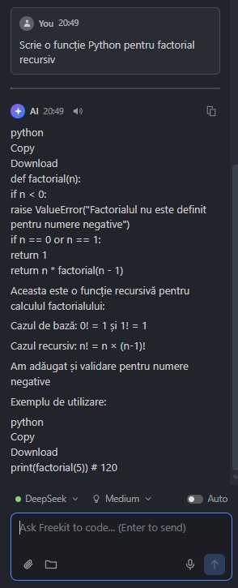
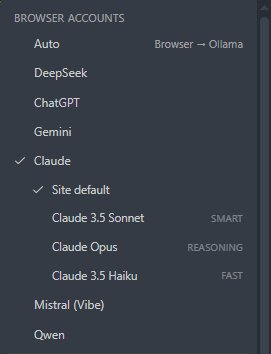
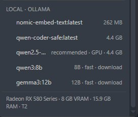
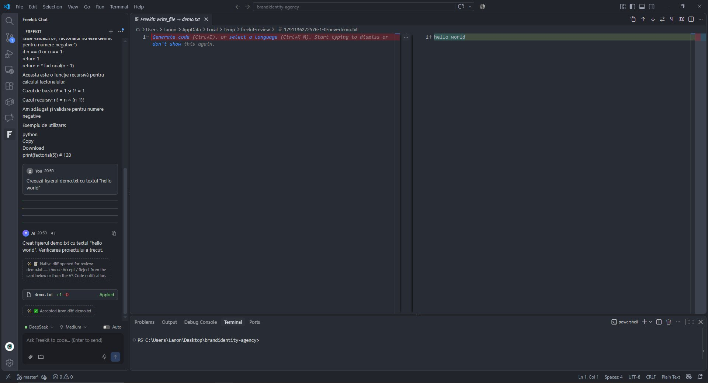
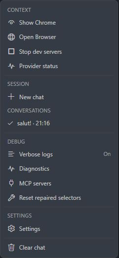
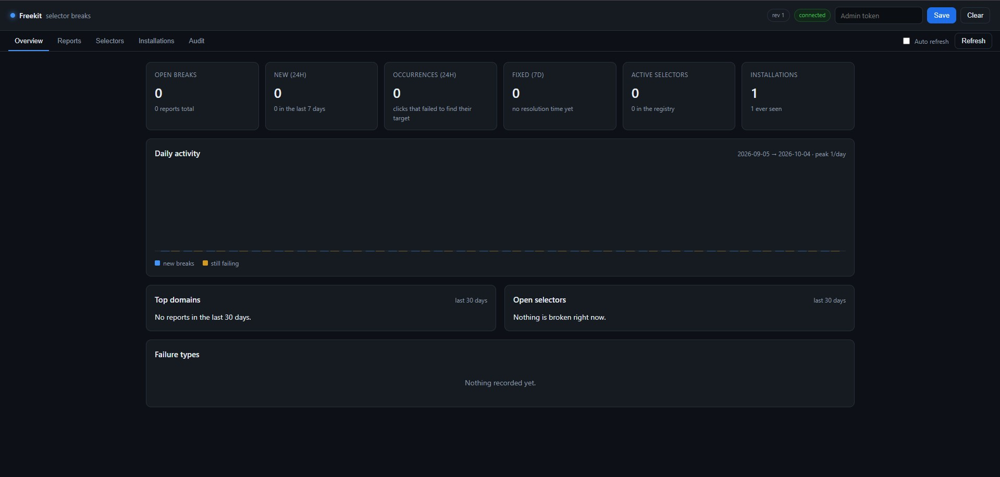

# Freekit

> **Free AI coding agent for VS Code.** Use your existing web AI accounts (DeepSeek, ChatGPT, Claude, Gemini, Mistral, Qwen) or a local Ollama model. No API keys, no subscriptions, no costs.

[](https://marketplace.visualstudio.com/items?itemName=builderweb.freekit)
[](https://code.visualstudio.com)

## Screenshots








## Why Freekit?

Unlike other AI coding agents, Freekit works with your existing web AI accounts:

| Feature | Freekit | Cline | Cursor | Copilot |
|---|---|---|---|---|
| Web AI providers (no API keys) | ✅ 6 | ❌ | ❌ | ❌ |
| Cost | **$0** | API costs | $20/mo | $10-19/mo |
| Local Ollama (hardware-aware) | ✅ | ✅ | ⚠️ | ❌ |
| Works with free accounts | ✅ | ❌ | ❌ | ❌ |
| Self-maintaining | ✅ | ❌ | ❌ | ❌ |
| Native VS Code diff | ✅ | ✅ | ✅ | ❌ |

**Perfect for:**

- Students and hobbyists without API budgets
- Developers in emerging markets (cost-sensitive)
- Anyone who already has a ChatGPT Plus / Claude Pro subscription
- Privacy-conscious users (local Ollama option)

## Features

- 🎯 **Six web AI providers + Ollama** — DeepSeek, ChatGPT, Claude, Gemini, Mistral, Qwen + local Ollama
- 🔒 **Stealth mode** — human-like typing (real keydown/keyup), anti-detection
- 🤖 **Agentic loop** — up to 40 iterations, 12 tools (read/write/edit/search/run/git)
- 📝 **Native diff review** — each file change opens in VS Code's diff viewer; accept or reject it from the card in the chat
- ⟲ **Git checkpoints** — restore any prompt with one click
- ✂️ **Fork & edit conversations** — ChatGPT-style conversation branching
- 🔊 **TTS + 🎤 voice input** — offline Whisper transcription
- 📚 **Semantic code search** — find code by meaning, not just text
- 🔌 **MCP servers** — Model Context Protocol support
- 🛡️ **Hardware-aware Ollama** — 51-model catalog, tiers T0-T6, auto-recommendation
- 🧪 **Auto-verify & auto-repair** — every file write is checked (`tsc --noEmit` / `astro check` / `build`); failures go back to the AI (up to 3 attempts) and are rolled back if they can't be fixed
- 🖥️ **Dev servers in a visible terminal** — `npm run dev`, `vite`, `nodemon`, … start in a dedicated VS Code terminal, and the AI gets the live URL immediately
- 🔍 **Verbose mode** — collapsible Thinking / Executing / Result / Decision cards for full transparency
- 📎 **Attachments & auto-context** — files, folders, images and binaries, plus project structure sent with every message

## Quick start

1. Install Freekit from the VS Code Marketplace
2. Open the sidebar → click the **F** icon
3. Click the **model chip** at the bottom → select a provider (e.g., DeepSeek)
4. A Chrome window opens → log in once (your session is saved)
5. Start chatting — try: `Write a Python function for factorial`

**First time?** VS Code may show a blue "Restricted Mode" banner. Click **Trust** to enable full functionality (Freekit writes files and runs commands — this is required).

## Supported providers

### Web (browser automation — no API key needed)

- **DeepSeek** (Chat V3 / DeepThink R1)
- **ChatGPT** (GPT-4o / GPT-4.1 / o3)
- **Claude** (Sonnet / Opus / Haiku)
- **Gemini** (2.5 Pro / 2.5 Flash)
- **Mistral** (Vibe)
- **Qwen**

### Local

- **Ollama** — 51-model catalog, hardware tiers T0-T6, auto-recommendation based on your VRAM and RAM; warns when a model is too small for real code (under 3B) and points to the free web providers on machines without a GPU

## Provider reliability for agentic tasks

Some providers occasionally refuse to emit an action, or lose the format on
long, multi-step tasks (reading many files, multi-file edits). In practice:

| Provider | Behaviour |
|----------|-----------|
| Gemini | Accepts from first message |
| DeepSeek | Accepts from first message |
| Ollama (local) | Always compliant |
| Claude | Rarely refuses |
| Mistral | Rarely refuses |
| Qwen | Rarely refuses |
| ChatGPT free | May refuse complex multi-step tasks |

For complex tasks, prefer Gemini, DeepSeek, or Ollama. If a provider refuses
mid-task, switch the **model chip** in the composer to another provider and
press Retry.

## How it works

Freekit connects to your **existing web AI sessions** via browser automation:

1. Launches an **isolated Chrome profile** (separate from your personal Chrome)
2. You log in **once** to each provider (session is saved)
3. Freekit types messages with **human-like keystrokes** (real keydown/keyup, random delays)
4. It reads the AI response and renders it in the VS Code sidebar
5. File changes appear as **native VS Code diffs** — accept or reject each one from the card in the chat

Everything is local. No middle server. No data sent to third parties.

## Privacy

- ✅ **Zero telemetry** — no analytics, no tracking
- ✅ **Isolated browser** — separate Chrome profile, doesn't touch your personal browser
- ✅ **Local by default** — Chrome profile, history and settings stay on your disk
- ⚠️ **Browser automation** — messages go through the web AI (same as if you typed them manually)
- ⚙️ **Self-reporting** (opt-in, on by default) — anonymous selector break reports to help fix issues. No code, files or messages sent. Disable: `freekit.reporting.enabled`
- 🔒 **Ollama option** — fully offline, nothing leaves your machine

## Trust / Restricted Mode

Freekit writes files, runs terminal commands and controls a browser — it needs a **trusted workspace**.

On first launch, VS Code shows a blue **"Restricted Mode"** banner. Click **Trust** to enable full functionality.

**In Restricted Mode (no trust):**

- ✅ Chat UI works
- ✅ Read-only tools (`read_file`, `search_files`, etc.)
- ❌ File writes, terminal commands, git mutations, MCP tools

You can also run `Freekit: Trust This Workspace` from the Command Palette.

Additional safeguards:

- Writes open a **native VS Code diff** for review — accept or reject from the **in-chat card** (the VS Code notification appears only as a fallback, when the chat card cannot be shown); shell commands and git operations require approval cards unless ⚡ auto-approve is enabled.
- Anti-spam limits: max 3 writes per file and 15 write operations per message.
- The webview runs with a strict Content Security Policy.

## Commands

| Command | What it does |
| --- | --- |
| `Freekit: Trust This Workspace` | Grant Workspace Trust to the current folder (opens the native dialog) — unlocks file writes, shell commands, git changes and MCP tools |
| `Freekit: Close Browser` | Really close it (graceful CDP close + PID fallback) |
| `Freekit: Show Browser` | Launch the dedicated Chrome if it is not running, then bring its window on screen and focus it (the old `Freekit: Open Browser` command still works as a hidden alias) |
| `Freekit: Show Provider Status` | Detailed report: CDP port, DeepSeek login, Ollama models |
| `Freekit: Clear No-Ask File List` | Forget the files you marked "Accept (don't ask again)" |
| `Freekit: Reset Repaired Selectors` | Forget auto-repaired selectors, go back to `selectors.json` |
| `Freekit: Update Selectors` | Fetch and apply the selector config from the configured Gist |
| `Freekit: Diagnostics` | Environment check: browser, CDP port, profile, Ollama, selectors, MCP |
| `Freekit: MCP Servers` | Manage MCP servers: status, restart/stop, list tools, open/create `.vscode/mcp.json` |
| `Freekit: Setup Local Whisper` | Download the prebuilt whisper.cpp binaries + `ggml-base` model into global storage (one time, ~160 MB) for offline voice input |
| `Freekit: Install Ollama` | Open the official Ollama download page (<https://ollama.com/download>); if a binary is already installed but the server isn't running, it just tells you to run `ollama serve` |
| `Freekit: Stop Dev Servers` | Stop every dev server started by the AI (sends Ctrl+C to its terminal; if the process ignores it, the terminal is closed) |
| `Freekit: Index Workspace` | Build / update the local semantic index (embeddings via Ollama, incremental, cancellable, with progress) |
| `Freekit: Index Status` | Show the index: model, dimensions, indexed files, chunks, storage file, size and last update |
| `Freekit: Clear Index` | Delete the workspace's semantic index from globalStorage (confirmation required) |
| `Freekit: Reporting Status` | Show the reporting integration: registration, endpoint, selectors revision, last health check / fetch — with shortcuts to run a check now or reset the identity |
| `Freekit: Run Selector Health Check` | Immediately check the selectors of the providers that have a tab open (repair locally, report only if the repair fails) |
| `Freekit: Reset Reporting Registration` | Remove the local reporting identity (apiKey + installation id); the extension registers as a new installation on the next start |

## Settings

| Setting | Default | Description |
| --- | --- | --- |
| `freekit.provider` | `deepseek` | Active provider (`auto` = browser provider → Ollama fallback) |
| `freekit.ollamaModel` | `qwen2.5-coder:7b` | Model used in local mode |
| `freekit.ollamaUrl` | `http://localhost:11434` | Ollama server URL |
| `freekit.cdpPort` | `9222` | CDP port used to launch / connect Chrome |
| `freekit.chromePath` | *(empty)* | Manual Chrome/Edge path (empty = auto-detect) |
| `freekit.messageTimeoutMinutes` | `20` | Total time budget for one agentic message |
| `freekit.autoVerify` | `true` | Check the project after every file write (`astro check` / `tsc --noEmit` / `build`); failures trigger up to 3 AI repair attempts, then an automatic rollback to the last verified state |
| `freekit.promptCheckpoints` | `true` | Create a git checkpoint before every prompt and show the ⟲ restore button on each user message |
| `freekit.autoInitGit` | `true` | Run `git init` (plus a minimal `.gitignore`, if missing) when the project folder isn't a git repo yet, so checkpoints / ⟲ restore work out of the box |
| `freekit.selectorsUrl` | *(empty)* | Raw URL of a public Gist with `selectors.json` (`version` + `providers`); empty = remote selectors disabled |
| `freekit.checkSelectorsOnStartup` | `true` | Look for a newer selector config at startup — at most once every 24 h (only when `freekit.selectorsUrl` is set) |
| `freekit.humanTyping` | `true` | Type messages with human timing (random delays, punctuation pauses, bursts); off = instant insertion |
| `freekit.humanBehavior` | `true` | Small mouse moves before clicks + occasional gentle scroll (anti-detect) |
| `freekit.mutationObserver` | `false` | Experimental: end-of-generation detection via MutationObserver (fast, low CPU). Can be flaky when Chrome runs offscreen — JS is suspended in invisible windows; default off = reliable 500 ms polling |
| `freekit.autoAcceptPopups` | `true` | Automatically accept consent popups (cookie / terms / “OK” / “Got it”). Safe exact-match on three confidence tiers; refusal wording (Reject / Only necessary / Customize / Not now) is never clicked; max 3 clicks per pass |
| `freekit.sttLanguage` | `ro-RO` | Language for the 🎤 voice input (local Whisper) — `ro-RO` (Romanian) or `en-US` (English); applied at the next transcription |
| `freekit.whisperCliPath` | *(empty)* | Path to `whisper-cli` (whisper.cpp) for offline voice input; empty = auto-detect (global storage → classic whisper.cpp locations → PATH) |
| `freekit.whisperModelPath` | *(empty)* | Path to the Whisper ggml model (e.g. `ggml-base.bin`); empty = auto-detect |
| `freekit.whisperTimeoutSeconds` | `180` | Timeout for one Whisper transcription (10–1200 s) |
| `freekit.aiSelectorFinder` | `true` | AI selector-discovery fallback: when the classic healer finds nothing, a filtered DOM snapshot (interactive elements + their ancestors only, not the whole page) is analyzed by local Ollama. The proposed chat-input selector is strictly validated in the page (visible, enabled, accepts typed text, inside the viewport, in the bottom half) and the analysis is retried up to 3 times with a more specific prompt, so a hidden helper input (`input[aria-label="Line wrap"]`) can no longer be saved; only validated selectors reach `selectors-user.json` |
| `freekit.aiFinderModel` | `auto` | Ollama model for the AI selector finder (independent of `freekit.ollamaModel`). `auto` = best installed chat model (`gemma3:12b` when available, else `qwen2.5-coder` → `qwen-coder` → `qwen` → `llama` → `mistral` → any other); embeddings models are never used |
| `freekit.aiFinderTimeoutSeconds` | `120` | Timeout (5–300 s) for the AI selector analysis; on expiry the stale locally learned selector is dropped and the static `selectors.json` one is used again |
| `freekit.mcpEnabled` | `true` | Start the configured MCP servers and expose their tools to the AI (`mcp_<server>_<tool>`) |
| `freekit.mcpServers` | `{}` | MCP servers to launch (stdio), e.g. `{"filesystem": {"command": "npx", "args": ["-y", "@modelcontextprotocol/server-filesystem", "."]}}` |
| `freekit.mcpToolTimeoutSeconds` | `60` | Timeout for a single MCP tool call (`tools/call`) |
| `freekit.semanticIndex.enabled` | `true` | Enable semantic code search (`search_semantic` tool + index commands) |
| `freekit.semanticIndex.model` | `nomic-embed-text` | Ollama embedding model for the index (changing it invalidates the index) |
| `freekit.semanticIndex.onSave` | `false` | Re-index a file automatically (incremental, debounced) when it is saved |
| `freekit.semanticIndex.maxFileKb` | `256` | Skip files larger than this (KB) when indexing |
| `freekit.semanticIndex.topK` | `8` | Number of chunks returned by `search_semantic` (1–25) |
| `freekit.semanticIndex.exclude` | `[]` | Extra directory/file names to exclude from indexing |
| `freekit.reporting.enabled` | `true` | Master switch for the reporting-server integration (anonymous registration + selector health checks + selector fixes) |
| `freekit.reporting.endpoint` | `https://api.builderweb.app` | Base URL of the reporting server |
| `freekit.reporting.shareDomSnapshot` | `false` | Also send a cleaned DOM snapshot (scripts/styles/media/input values stripped) when reporting a broken selector |
| `freekit.reporting.healthCheck` | `true` | Periodically verify the selectors of providers that already have a tab open; repair locally first, report only if the repair fails |
| `freekit.reporting.healthCheckIntervalHours` | `6` | Hours between two automatic selector health checks |
| `freekit.reporting.selectorsIntervalHours` | `24` | Hours between two automatic fetches of repaired selectors from the server |

## Advanced

### Semantic code search

Freekit can find code **by meaning** instead of exact text — useful for questions like *"where do we retry a failed upload?"* when you don't know the identifier to grep for.

1. Run **`Freekit: Index Workspace`** once (needs Ollama running; the embedding model is pulled with `ollama pull nomic-embed-text`).
2. Ask the AI something conceptual. It calls `search_semantic(query)` and gets back the best-matching chunks with `path:startLine-endLine`, a similarity score and a snippet — then it can `read_file` the ones that matter.

How it works:

- **Local & private** — embeddings are computed by your own Ollama server (`freekit.ollamaUrl`); the vector store is a single JSON file under `<globalStorage>/semantic-index/` (keyed per workspace). No new npm dependencies, no cloud.
- **Incremental** — each file is fingerprinted with a SHA-1 of its content; unchanged files keep their existing vectors, so re-indexing after an edit only re-embeds what changed. Set `freekit.semanticIndex.onSave` to keep the index fresh automatically (debounced 1.5 s).
- **Smart exclusions** — `node_modules`, `.git`, `out`, `dist`, `build`, `.next`, `coverage`, virtualenvs, `target`, caches, lockfiles, source maps, minified and binary files are never indexed; extend the list with `freekit.semanticIndex.exclude`.
- **Chunking with overlap** — files are split into 60-line windows with a 12-line overlap so a function that straddles a boundary is still found; oversized/minified files are skipped and recorded in the status.
- **Graceful in the agent loop** — if there is no index yet, `search_semantic` returns a clear message telling the AI to fall back to `search_files` (or you to run the index command), so nothing breaks.

### Remote selector updates

Selector repairs can reach every client without shipping a new extension version:

1. Keep the same JSON shape as `src/selectors.json` and **bump `version`** (`updated` / `changelog` are optional but recommended).
2. Save it as a file named `selectors.json` in a **public GitHub Gist**.
3. Set `freekit.selectorsUrl` to the Gist **raw** URL, e.g. `https://gist.githubusercontent.com/<user>/<id>/raw/selectors.json`.

Freekit then checks on startup — rate-limited to once every 24 h — and on demand via `Freekit: Update Selectors`, applying the config only when its `version` is newer than the active one. The update is validated, merged over the bundled config, cached locally, and local auto-repairs for the slots it touches are replaced by the curated fix. Any failure (invalid JSON, HTTP error, timeout) leaves the current config in place.

### Reporting server (self-maintaining)

Freekit can feed a central reporting server (`https://api.builderweb.app` by default) so a site redesign discovered on one machine turns into a fix for everybody — without waiting for an extension release.

- **Register once** — on first start the extension creates a random **installation id** (globalStorage) and exchanges it for an `apiKey` (`POST /api/v1/extensions/register`). The call is idempotent: the key is cached and re-used until you run `Freekit: Reset Reporting Registration`.
- **Health check every 6 h** (`freekit.reporting.healthCheckIntervalHours`) — for every provider that **already has a tab open** in the Freekit Chrome profile, the `input` and `newChat` selectors are verified. Chrome is never started just for this. Broken slots are repaired **locally first** (fingerprint healer → AI finder); only if that also fails is a report sent (`POST /api/v1/reports`) with the domain, the failing selector, the failure type (`not_found` / `hidden`) and the page URL.
- **Selector updates every 24 h** (`freekit.reporting.selectorsIntervalHours`) — the extension asks `GET /api/v1/selectors?since=<revision>`, applies anything new (validated by the same fragile/blacklist rules as local repairs) and remembers the revision, so a `304` is the normal, cheap answer.
- **Privacy** — nothing from your code, prompts or files is ever sent. The only optional payload is the **cleaned DOM snapshot** (scripts, styles, media and input values are stripped, truncated) and it is **off by default** (`freekit.reporting.shareDomSnapshot`). Set `freekit.reporting.enabled` to `false` to opt out completely.

Use `Freekit: Reporting Status` for the current state (registration, revision, last check), `Freekit: Run Selector Health Check` to run a check immediately (e.g. right after a site redesign) and `Freekit: Reset Reporting Registration` to start over with a new identity.

### MCP servers

Freekit ships a **Model Context Protocol** client: MCP servers give the agent extra tools (databases, browsers, APIs, file systems, …) beyond the built-in ones. Configure them once — they are launched with VS Code and their tools are exposed to the AI as `mcp_<server>_<tool>`.

1. Add servers to `.vscode/mcp.json` (or to the `freekit.mcpServers` setting):

```json
{
  "servers": {
    "filesystem": {
      "command": "npx",
      "args": ["-y", "@modelcontextprotocol/server-filesystem", "."]
    }
  }
}
```

2. Servers start with VS Code (`freekit.mcpEnabled`, default on) and config edits are hot-reloaded. Use **`Freekit: MCP Servers`** to check status, restart/stop a server, or list its tools.

Every MCP call shows an **approval card** (server, tool and arguments) before it runs — ⚡ auto-approve skips it like any other tool. Only the **stdio** transport is supported. A crashed or missing server is reported in the chat and in `Freekit: Diagnostics`.

## Troubleshooting

**"Could not find the input box"**

→ Log in to the provider. Click **Show Browser** in the ⋯ menu, sign in, then retry.

**"Restricted Mode — some features disabled"**

→ Click **Trust** in the blue banner at the top of VS Code.

**"Ollama not running"**

→ Install Ollama from [ollama.com](https://ollama.com/download) and run `ollama serve`.

**Browser automation issues**

→ Click **Freekit: Reset Repaired Selectors** and try again.

## Requirements

- VS Code **1.90+**
- **Chrome or Edge** (installed)
- **Ollama** (optional, for local models)
- **Windows / macOS / Linux**

## Development

```bash
npm install
npm run compile        # tsc → out/
npx @vscode/vsce package
code --install-extension freekit-2.5.24.vsix --force
```

Press <kbd>F5</kbd> for an Extension Development Host.

## Support

Freekit is free — no API keys, no subscriptions. If it saves you time, you can buy me a coffee:

[](https://buymeacoffee.com/builderweb)

## License

Proprietary. See [LICENSE.txt](./LICENSE.txt).

---

**Made by [builderweb](https://builderweb.app)** · [Buy me a coffee](https://buymeacoffee.com/builderweb)
